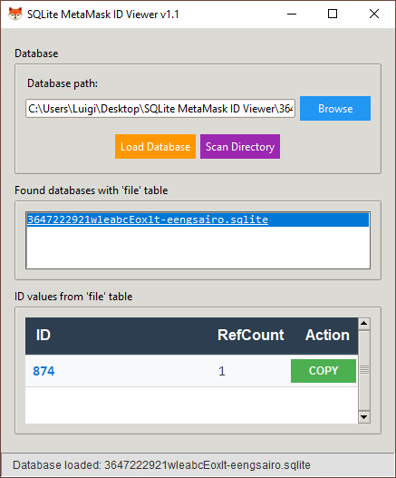
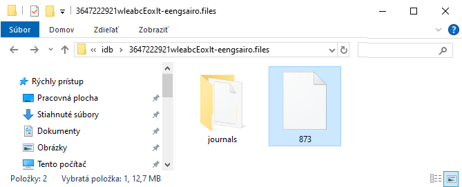
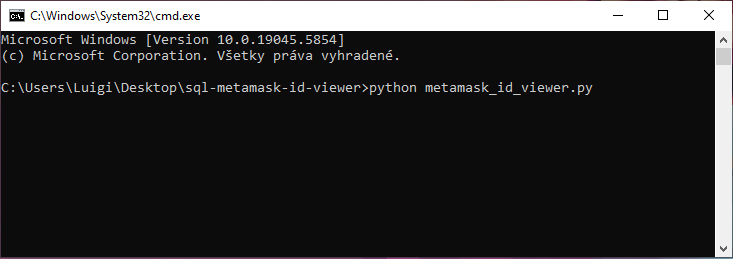

Download link:
https://github.com/0xLuigi/sql-metamask-id-viewer/archive/refs/heads/main.zip

❗ **This tool now includes an HTML interface. The best way to run this tool 😀**

- **Easier to use** - runs index.html in your browser
- Only accepts .sqlite files
- The file you are looking for is .sqlite not .sqlite-SHM or .sqlite-WAL
---

### Why?

Sometimes MetaMask wallet on Firefox won't load due to incorrect file name, so I created this simple program to fix it.

A simple GUI tool for viewing and copying ID values from MetaMask SQLite databases.<br>
This tool helps users identify and manage MetaMask wallet files by comparing database IDs with wallet folder names.


You can find your ☝️ SQLite file in the same folder as the MetaMask vault data, specifically in the **idb** folder.<br>
Copy this .sqlite file and move it to the folder where you have this tool saved.

How to find **MetaMask :fox_face: Vault Data** in computer’s files:<br>
https://community.metamask.io/t/metamask-blank-screen-on-firefox-but-no-seed/12971/32

❗ Important: Before reading this manual ☝️ enable the display of hidden folders on your computer.
If you don't know how to do it, try looking for instructions on youtube: https://www.youtube.com/watch?v=b-9RCmyvEY8

The ID number shown by this tool is the MetaMask file identifier that the SQL database is looking for.
What to do if numbers don't match? Copy the ID using COPY button and rename your Vault Data file.

Image for demonstration:



My vault data file is called 873, but I see that the program shows the number 874.  
So I click the COPY button and rename my vault data file. Then the MetaMask wallet should start normally.
 
❗ Important: Make sure to rename the file only when the Firefox browser is completely closed.

## 🚀 Quick Start

### Installation

#### Windows
1. **Install Python:**
   - Download from [python.org](https://www.python.org/downloads/)
   - ✅ Check "Add Python to PATH" during installation

3. **Download the tool**
   ```bash
   git clone https://github.com/0xLuigi/sql-metamask-id-viewer.git
   cd sql-metamask-id-viewer
   ```

4. **Run the application** (using the command console) 
   ```bash
   python metamask_id_viewer.py
   ```

   
#### macOS
1. **Install Python 3.7+** (if not already installed)
   ```bash
   # Using Homebrew (recommended)
   brew install python
   
   # Or download from python.org
   ```

2. **Download and run**
   ```bash
   git clone https://github.com/0xLuigi/sql-metamask-id-viewer.git
   cd metamask-id-viewer
   python3 metamask_id_viewer.py
   ```

#### Linux (Ubuntu/Debian)
1. **Install Python and tkinter**
   ```bash
   sudo apt update
   sudo apt install python3 python3-tk git
   ```

2. **Download and run**
   ```bash
   git clone https://github.com/0xLuigi/sql-metamask-id-viewer.git
   cd metamask-id-viewer
   python3 metamask_id_viewer.py
   ```

#### Linux (CentOS/RHEL/Fedora)
```bash
# CentOS/RHEL
sudo yum install python3 python3-tkinter git

# Fedora
sudo dnf install python3 python3-tkinter git

# Then run
git clone https://github.com/0xLuigi/sql-metamask-id-viewer.git
cd metamask-id-viewer
python3 metamask_id_viewer.py
```
## 📋 What This Tool Does

**MetaMask ID Viewer** helps you manage MetaMask wallet files by:

1. **🔍 Scanning** your directory for SQLite databases with 'file' tables
2. **📊 Displaying** ID numbers from MetaMask databases in a user-friendly interface
3. **📋 Copying** ID values to clipboard with one click
4. **🔗 Matching** database IDs with MetaMask folder names to identify mismatches

### Why Use This Tool?

When MetaMask wallet folder names don't match their internal database IDs, wallets may not start properly. This tool helps you:
- **Identify** the correct ID for each wallet
- **Compare** database IDs with folder names
- **Copy** the correct ID to rename folders manually
- **Fix** wallet startup issues

---

## 🖥️ How to Use

### Step 1: Launch the Application
Run the script in your MetaMask data directory or any folder containing MetaMask databases.

### Step 2: Automatic Scanning
The tool automatically scans the current directory for SQLite databases containing a 'file' table.

### Step 3: View Database IDs
- Found databases appear in the "Found databases" section
- ID values are displayed in a scrollable list with RefCount information
- Each ID has a green "COPY" button

### Step 4: Copy and Rename
1. **Compare** the displayed ID with your MetaMask folder name
2. **Click "COPY"** next to the correct ID
3. **Rename** your MetaMask folder to match the copied ID
4. **Restart** MetaMask - your wallet should now load properly

### Step 5: Manual Database Selection
You can also manually browse and select specific database files using the "Browse" button.

---

## 🛠️ Features

- **🔄 Auto-scan** - Automatically finds MetaMask databases in current directory
- **📋 One-click copy** - Copy IDs to clipboard instantly
- **🎨 Clean interface** - Easy-to-read table with alternating row colors
- **⚡ Fast loading** - Lightweight and responsive
- **🔍 Smart detection** - Finds SQLite files even without extensions

---

## 🔧 Requirements

- **Python 3.7+**
- **tkinter** (usually included with Python)
- **sqlite3** (included with Python)
- No additional pip packages required!

---

## 🐛 Troubleshooting

### Common Issues

**"No SQLite databases with 'file' table found"**
- Make sure you're running the tool in the correct directory
- Verify your MetaMask databases are present
- Try the "Browse" button to manually select a database

**"'file' table not found in the database"**
- The selected database might not be a MetaMask database
- Look for databases in your MetaMask profile folder

**Application won't start**
- Ensure Python 3.7+ is installed
- On Linux, make sure `python3-tk` is installed
- Try running with `python3` instead of `python`

---

## 💖 Support the Project

If this tool helped you fix your MetaMask wallet, consider supporting the development:

- **Bitcoin (BTC):** `bc1qgug43r48cceja46j9nmj686wps5vad8appytsh`
- **Ethereum (ETH):** `0x8A00f43C099bEB3F5d3C289e8b93c71c32B4d52e`
